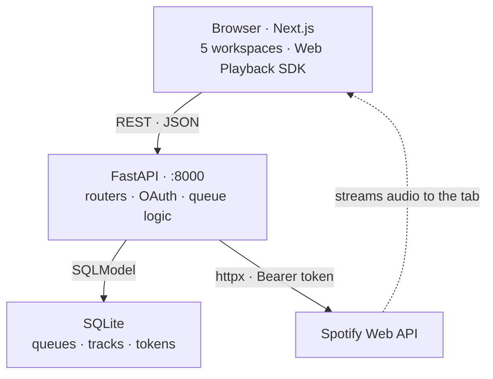

# 🎯 FocusLab

**One workspace for everything a study session needs — your time, your tasks, your notes, your schedule, and your sound.**

Studying is a coordination problem before it's a discipline problem: five things in five places, and every switch costs focus. FocusLab collapses them into one environment that runs entirely on your machine. No accounts, no cloud, no telemetry.

Built by students, for students.

## Workspaces

| | Workspace | Purpose | State |
|---|---|---|---|
| 🏠 | **Home** | Pomodoro timer + Spotify-connected focus queues | **Shipped** |
| 📚 | **Notebook** | Session notes kept beside the work | Routed, UI pending |
| ✅ | **To-Do** | Task and assignment tracking | Routed, UI pending |
| 🤖 | **AI Study** | AI-assisted revision tools | Routed, UI pending |
| 📅 | **Calendar** | Deadlines and study scheduling | Routed, UI pending |

Home is complete end to end — UI, API, database and a third-party integration in production shape. The other four are navigable shells; the architecture exists to make adding them routine.

## Home, today

- **Focus timer** — 5/15/25-minute presets or any custom length, with restart and skip.
- **Focus queues** — named, ordered, persisted locally. Search Spotify inline, and play a queue as a whole so tracks advance without ever mutating what you saved.
- **Music without leaving the app** — FocusLab registers *itself* as a Spotify Connect device via the Web Playback SDK. Audio plays out of the tab; the Spotify client never has to be open.

## Engineering highlights

Shipping one workspace against a real third-party API surfaced problems worth documenting.

**Spotify Connect device targeting.** Spotify plays nothing itself — it forwards commands to a *device*. Without a `device_id` it targets "the currently active device", and an open-but-idle client is **available but not active**, so playback 404'd with a device sitting right there. Now a concrete device is resolved and named up front, which both routes the audio and wakes an idle client — preferring one already playing, so FocusLab controls your phone rather than hijacking it.

**The browser as a device.** The tab registers as a Connect device via the Web Playback SDK. Three pieces had to line up: a short-lived token endpoint for the browser (the refresh token stays server-side), a `device_id` override on every playback route, and a `Permissions-Policy` naming `sdk.scdn.co` for `encrypted-media` and `autoplay` — without which protected audio is silently blocked in the SDK's cross-origin iframe.

**Self-healing stale device IDs.** The SDK reconnects under a *new* id on every reload or dropped connection, so clients easily hold ids Spotify has destroyed. A `404` triggers one re-resolve and retry, guarded so it only fires for caller-supplied ids that actually changed.

**Observation over documentation.** Spotify's docs say playback commands return `204 No Content`. They return `200` with a bare non-JSON command id and no `content-type`, so `.json()` raised and every command 500'd. Success parsing now keys off the header, not the spec.

**Honest error translation.** Pausing an already-paused player returns Spotify's `403 "Restriction violated"` — really just poll lag — and becomes a `409 Conflict` the frontend treats as a resync cue. Genuine `403`s pass through verbatim.

**OAuth 2.0 done properly.** Authorization Code with a random `state` in an `httponly`, `samesite=lax` cookie compared via `secrets.compare_digest`. Tokens refresh 60 seconds early to close the valid-at-check, expired-on-arrival race. Client secret and refresh token never leave the server.

## Architecture



The backend never touches audio — it authenticates, persists, and translates intent into commands. The browser is both the UI *and* the output device.

Spotify access is layered so each level owns one concern, which is why the device fix touched a single function rather than every route:

```
route → player_command → spotify_api_request → httpx
        picks + heals    token + error mapping
```

## Tech stack

**Frontend** Next.js 16 · React 19 · TypeScript · Tailwind CSS 4 · Spotify Web Playback SDK
**Backend** FastAPI · SQLModel · SQLite · httpx · Spotify Web API (OAuth 2.0)
**Infra** Docker Compose

## Structure

Routes split by resource *and* by read/write, so a filename says what it does.

```
backend/routers/
  spotify.py       router + shared plumbing
  spotify_get.py     ↳ status, player, devices, search, OAuth
  spotify_post.py    ↳ pause, resume, next, previous
  queues.py        router + shared plumbing
  queues_get.py      ↳ list queues, one queue + tracks
  queues_post.py     ↳ create, rename, delete, add/remove track, play

frontend/app/
  (0)Intro_Components/   landing
  (1.1)Home/             timer, queues, in-browser player, sidebar
  (1.2)Notebook/  (1.3)To-Do/  (1.4)AI_Study/  (1.5)Calendar/
```

## Getting started

Requires [Docker Desktop](https://www.docker.com/products/docker-desktop/). The music features need **Spotify Premium**; everything else runs without a Spotify account.

1. Create an app at the [Spotify dashboard](https://developer.spotify.com/dashboard), adding `http://127.0.0.1:8000/spotify/callback` as a redirect URI.
2. Copy `backend/.env_example` → `backend/.env` and fill in `SPOTIFY_CLIENT_ID`, `SPOTIFY_CLIENT_SECRET`, `SPOTIFY_REDIRECT_URI`.
3. Run it:

```bash
docker compose build     # first run only
docker compose up
```

App on [:3000](http://localhost:3000) · API on [:8000](http://localhost:8000) · interactive API docs at [/docs](http://localhost:8000/docs).

## Security

Single-user local application, with boundaries stated rather than assumed:

- Client secret and refresh token are server-side only — a leaked access token dies within the hour and can't be renewed.
- OAuth `state` verified in constant time; bodies schema-validated so clients can't set ids or timestamps.
- CORS is documented for what it *is*: a browser rule about which origins may read responses, **not** an access control — non-browser callers send no `Origin` and bypass it.
- Ports publish on all interfaces; binding to `127.0.0.1` is the one-line change that makes "local only" literally true.

Public distribution would need **Authorization Code with PKCE**, since a shipped binary can't hold a client secret.


## License

MIT
