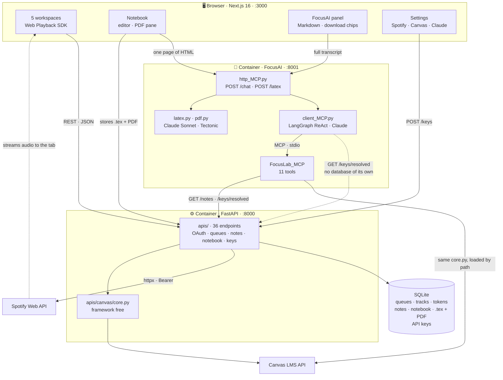

<div align="center">

# 🎯 FocusLab

### Five study tools in one window. Spotify plays *inside the app*. An AI agent reads your own notes and *every* course on your Canvas. Your notes come back typeset in LaTeX.

**Runs entirely on your machine.**

[](https://nextjs.org)
[](https://react.dev)
[](https://www.typescriptlang.org)
[](https://fastapi.tiangolo.com)
[](https://modelcontextprotocol.io)
[](https://www.anthropic.com)
[](https://tectonic-typesetting.github.io)
[](https://developer.spotify.com/documentation/web-api)
[](https://www.docker.com)


| **36** | **11** | **3** |
|:---:|:---:|:---:|
| REST endpoints | MCP tools | containerised services |

</div>

---

## What this is

- **Ask about your coursework and get answers.** FocusLab ships its own MCP server — 11 tools over Canvas *and your own notes* — so the chat panel can:
  - *"what's due this week?"* — across every course, not one at a time
  - *"give me lectures 1 to 3"* — links come back clickable, straight from Canvas
  - *"what is theory of computation about?"* — reads the course, or your own notes, and says
- **Spotify plays inside the app.** FocusLab registers itself as a Connect device — the desktop client never has to be open.
- **Notes come back typeset.** Write a page, press *Transform to LaTeX*, get a compiled PDF in the pane beside it.
- **Nothing to configure.** No `.env`, no keys in files — you paste them into the app's own settings page.


</details>

**Stack** · Next.js 16 · React 19 · TypeScript 5 · Tailwind 4 · FastAPI · SQLModel · SQLite · httpx · MCP (FastMCP) · LangGraph · Claude Sonnet 5 + Haiku 4.5 · Tectonic · Docker Compose

---

## Architecture




---

## Run it

```bash
git clone https://github.com/MatiasPF1/FocusLab.git
cd FocusLab
docker compose up
```

Frontend on `:3000`, API docs on `:8000/docs`, FocusAI on `:8001`. Three services, one command, no configuration files to fill in first.

Keys are entered in the app instead: the gear at the foot of the sidebar opens a settings page with a tab per service — Spotify, Canvas, Claude — each carrying the steps and the link to where its key comes from. They are stored in the backend's own database and never leave the machine. Nothing needs a restart after saving, and the app runs without them; each service simply stays off until its tab is filled in.

Spotify needs an app at [developer.spotify.com](https://developer.spotify.com/dashboard) with redirect URI `http://127.0.0.1:8000/spotify/callback` — they banned `localhost` redirects on 2025-11-27, so the loopback IP is required. The settings page states the same URI, ready to copy.

The agent image carries the LaTeX engine, so its first build is the slow one: a static Tectonic binary plus a warm up compile that pulls every package a converted page needs into the image. That costs about 110 MB once, and buys a first conversion that typesets immediately instead of waiting on downloads.

Its instructions are not in the Python. They live in `Client_MCP/skills/`, one folder per capability — `canvas-coursework`, `student-notes` — each a `SKILL.md` carrying `name`/`description` frontmatter and its rules in Markdown, the shape Anthropic's Agent Skills use. `prompt.py` loads them in a fixed order and wraps them in the agent's own framing. Teaching FocusAI something new is a folder, not a longer string, and `python Client_MCP/prompt.py` prints exactly what the model will be sent.

The agent also answers on the command line, which is the faster loop when working on its prompt or tools:

```bash
python Client_MCP/client_MCP.py "what is due this week?"
```

Request path: `browser → http_MCP.py → client_MCP.py → FocusLab_MCP/server.py`, the last hop over stdio. With the service down, the panel still opens and says so rather than failing silently.

---

## Security model

Single user, localhost only

- **Every port is published to `127.0.0.1`, not `0.0.0.0`.** None of these services authenticates its caller, and that is deliberate for a single-user desktop app — what makes it safe is being unreachable from anywhere but this machine. A bare `"8000:8000"` in compose binds every interface, which on campus wifi puts the API on the subnet for anyone who scans it. CORS does not help here; it constrains browsers, not `curl`.
- **Keys are the user's own and stay on their machine.** They are typed into the settings page, stored in the local database, and read back write only: `/keys/status` reports that a secret exists, never what it is. One route returns a secret, `/keys/resolved`, and it exists because the agent runs as its own process with no database of its own.
- **Refresh tokens never reach the browser.** The frontend gets short lived access tokens from a dedicated endpoint.
- **CSRF state is server side**, timing safe, single use, 10 minute TTL. CORS is an allowlist, and it is not authentication.
- **Agent file writes are sandboxed** to `~/Downloads`, folder and filename both sanitized against traversal. Under Docker that path is inside a container, so the panel hands files over as Canvas links instead.
- **Pre signed Canvas URLs redirect across three hosts**, so downloads carry no `Authorization` header.
- **LaTeX is compiled as untrusted input.** The document was written by a model a moment earlier, so Tectonic runs with `--untrusted` — no shell escape, no reading outside its own directory — in a temporary directory deleted with everything the run left behind.
- **Pictures a page only links to are fetched server side**, with a timeout, a size ceiling, and the format decided by sniffing the bytes rather than believing the `Content-Type` header.

---

## License

MIT
