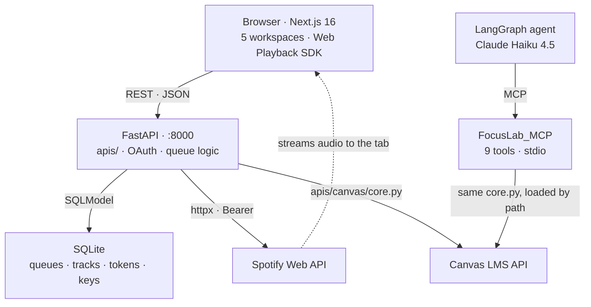

<div align="center">

# 🎯 FocusLab

### Five study tools in one window. Spotify plays *inside the app*. Canvas coursework is queryable by an AI agent.

**No accounts. No cloud. No telemetry. Runs entirely on your machine.**

[](https://nextjs.org)
[](https://react.dev)
[](https://www.typescriptlang.org)
[](https://fastapi.tiangolo.com)
[](https://www.python.org)
[](https://modelcontextprotocol.io)
[](https://developer.spotify.com/documentation/web-api)
[](https://www.docker.com)


| **6,300** | **28** | **9** | **5** |
|:---:|:---:|:---:|:---:|
| lines of code | REST endpoints | MCP tools | workspaces |

</div>

---

## What this is

Studying is a coordination problem before it is a discipline problem. Five tools in five tabs, and every switch costs focus.

Two parts are hard, and both are built here:

**1. FocusLab registers itself as a Spotify Connect device.** Audio streams into the app's own tab. The Spotify client never has to be open. That required device targeting, DRM iframe permissions, self healing device IDs, and an OAuth flow the vendor documents incorrectly.

**2. FocusLab ships its own MCP server.** Nine tools over Canvas LMS, consumed by a LangGraph agent and by the app's own REST API from a single implementation. Ask "where are the homework solutions for Theory of Computation" and get real file names back.

---

## What it demonstrates


| Area | Evidence in this repo |
|---|---|
| **OAuth 2.0 from scratch** | Authorization Code flow, CSRF `state` with timing safe comparison, single use replay protection, 60s early token refresh. No auth library. |
| **Protocol design (MCP)** | Own FastMCP server, 9 tools, stdio transport. Tool descriptions are the agent's only guidance channel, so every misleading default is documented in them. |
| **Agent engineering** | LangGraph ReAct agent on Claude Haiku 4.5. Three separate failure classes found and fixed by hardening prompts and tool contracts, not by adding tools. |
| **Zero duplication across surfaces** | `apis/canvas/core.py` is framework free, so the same functions serve FastAPI routes and MCP tools. The MCP server loads it by file path and never imports FastAPI. |
| **Third party API archaeology** | Spotify and Canvas both return data that contradicts their docs. Both are handled by observation, documented inline. |
| **Layered architecture** | The Spotify device fix touched *one function*, not twelve routes, because the layers were drawn correctly. |
| **Security reasoning** | Threat model stated explicitly. LLM driven file writes are path sanitized. Pre signed URLs are fetched without forwarding credentials. |
| **Containerisation** | One `docker compose up` from clone to running. |

---

## Screenshots

<div align="center">

| Landing | Guided setup |
|---|---|
|  |  |

</div>

---

## Workspaces

| | Workspace | Purpose | State |
|---|---|---|---|
| 🏠 | **Home** | Pomodoro timer, Spotify queues, live Canvas tasks | ✅ **Shipped** |
| ✅ | **To-Do** | Task and assignment tracking | API done, UI pending |
| 📚 | **Notebook** | Session notes kept beside the work | API done, UI pending |
| 🤖 | **AI Study** | Agent backed revision tools | MCP layer done, UI pending |
| 📅 | **Calendar** | Deadlines and study scheduling | Routed, UI pending |

Home is complete end to end: UI, API, database, and two third party integrations in production shape.

---

## The Canvas MCP server

Nine tools, ordered by hierarchy so the agent traverses a course the way a student does.

```
1  Find the course      list_courses
2  Course structure     get_modules, get_assignments
3  Content in an item   get_page_files, get_assignment_files
4  Onto disk            download_files
5  Grades               get_grades, get_assignment_grades, get_unsubmitted
```

Canvas fights you at every level. Four examples that are all handled:

| What the API says | What is actually true |
|---|---|
| `name` is the course name | `name` is the section code (`2026S CS 334-A`). `course_code` holds the readable title (`Theory of Computation`). Inverted. |
| Modules return a tree | Modules return a flat list. Nesting lives in `indent`, which is what the web UI renders. |
| Lecture slides are files | Lecture slides are `<a href>` links inside a Page's HTML body. Module items report `file: null`. |
| `ExternalUrl` items carry a link | `html_url` is a dead `module_item_redirect` stub. The real destination is `external_url`. |

Downloads stream from Spotify style pre signed URLs that redirect across three hosts, so the Canvas token is never attached to the request. Filenames and folders both pass through a sanitizer: `../../evil.exe` becomes `evil.exe`, and nothing escapes `~/Downloads`.

---

## Engineering highlights

<details open>
<summary><b>Spotify device targeting: playback 404'd with a device sitting right there</b></summary>

<br>

Spotify plays nothing itself. It forwards commands to a **device**. Without a `device_id` it targets "the currently active device", and an open but idle client is **available but not active**. Playback returned `404` while a perfectly good device sat idle.

The fix resolves a concrete device up front, which routes the audio *and* wakes an idle client, preferring one already playing so FocusLab **controls** your phone rather than hijacking it.

</details>

<details>
<summary><b>The browser as a device: three things had to line up at once</b></summary>

<br>

1. A short lived token endpoint for the browser. The **refresh token never leaves the server**.
2. A `device_id` override on every playback route.
3. A `Permissions-Policy` naming `sdk.scdn.co` for `encrypted-media` and `autoplay`.

Miss #3 and protected audio is **silently blocked** inside the SDK's cross origin iframe. No error, no console warning, nothing.

</details>

<details>
<summary><b>Observation over documentation: every playback command was 500'ing</b></summary>

<br>

Spotify's docs say playback commands return `204 No Content`. They actually return **`200` with a bare non JSON command id and no `content-type` header**, so `.json()` raised and every command 500'd.

Success parsing now keys off the response header, not the spec.

</details>

<details>
<summary><b>The OAuth state cookie that broke on a hostname</b></summary>

<br>

CSRF `state` lived in an `httponly` cookie. Logins started at `localhost:8000` silently failed, because the redirect URI is `127.0.0.1:8000` and **cookies are host scoped**. The cookie never came back and the flow died at `?spotify=error`.

State is now **server side** with a 10 minute TTL, same timing safe `compare_digest`, plus two properties the cookie never had:

- **Replay protection.** State is consumed on first use. One state, one callback.
- **No browser dependency.** A packaged desktop build using a custom scheme redirect has no cookie jar at all.

</details>

<details>
<summary><b>An agent that was confidently a year wrong</b></summary>

<br>

Asked for "my worst grade this semester", the agent scanned every term and returned `76.71 in 2025S MA 125`. A global minimum from the wrong year.

The tools were fine. The model had no concept of *now*. Injecting the current date into the system prompt fixed it: `82.37 in MA 232`, correct term.

Two more failures followed the same shape. A missing capability (no file tools) and an unresolvable course name (only the section code was returned). Neither was solved by adding tools, but by fixing what the tools *told* the agent.

</details>

<details>
<summary><b>One import that killed the entire API</b></summary>

<br>

`apis/canvas/core.py` built its `httpx` client at import time, reading `os.environ['CANVAS_URL']`. Mounting the Canvas router meant `main.py` imported that module, so on a container without Canvas credentials the app raised `KeyError` before uvicorn ever started. Every route died, including Spotify.

The client is now built on first use. Missing Canvas config returns `503` from `/canvas/tasks` and nothing else notices.

</details>

---

## Architecture



**The backend never touches audio.** It authenticates, persists, and translates intent into commands. The browser is both the UI and the output device.

Spotify access is layered so each level owns one concern, which is why the device fix touched a single function:

```
route → player_command → spotify_api_request → httpx
        picks + heals     token + error mapping
```

Dependency direction is one way, enforced by structure:

```
router.py  ←  OAuth_Logic.py  ←  core.py  ←  routes/
(no deps)     flow + tokens      Web API     handlers
```

---

## Tech stack

| Layer | Technologies |
|---|---|
| **Frontend** | Next.js 16 · React 19 · TypeScript 5 · Tailwind CSS 4 · Spotify Web Playback SDK |
| **Backend** | FastAPI · SQLModel · SQLite · httpx · Spotify Web API · Canvas LMS API |
| **Agent** | MCP (FastMCP) · LangGraph · LangChain · Claude Haiku 4.5 |
| **Infra** | Docker Compose |

---

## Getting started

```bash
git clone https://github.com/MatiasPF1/FocusLab.git
cd FocusLab

cp backend/.env.example backend/.env      # Spotify credentials, optional Canvas token
docker compose up
```

Frontend on `:3000`, API and interactive docs on `:8000/docs`.

Spotify requires an app at [developer.spotify.com](https://developer.spotify.com/dashboard) with redirect URI `http://127.0.0.1:8000/spotify/callback`. Spotify banned `localhost` redirects on 2025-11-27, so the loopback IP is required.

To run the agent:

```bash
cp Client_MCP/.env.example Client_MCP/.env    # Canvas token, Anthropic key
pip install -r Client_MCP/requirements.txt
python Client_MCP/client_MCP.py "what is due this week?"
```

---

## Security model

Single user, localhost only, by design.

- **Refresh tokens never reach the browser.** The frontend gets short lived access tokens from a dedicated endpoint.
- **CSRF state is server side**, timing safe, single use, 10 minute TTL.
- **CORS is an allowlist**, and the threat it stops is another site reading responses. It is not authentication.
- **Agent file writes are sandboxed** to `~/Downloads`, folder and filename both sanitized against traversal.
- **Pre signed Canvas URLs redirect across three hosts**, so downloads carry no `Authorization` header.

---

## Roadmap

To-Do and Notebook UIs on their finished APIs. Agent backed AI Study workspace on the existing MCP layer. Electron packaging with PKCE and a loopback redirect.

---

## License

MIT
