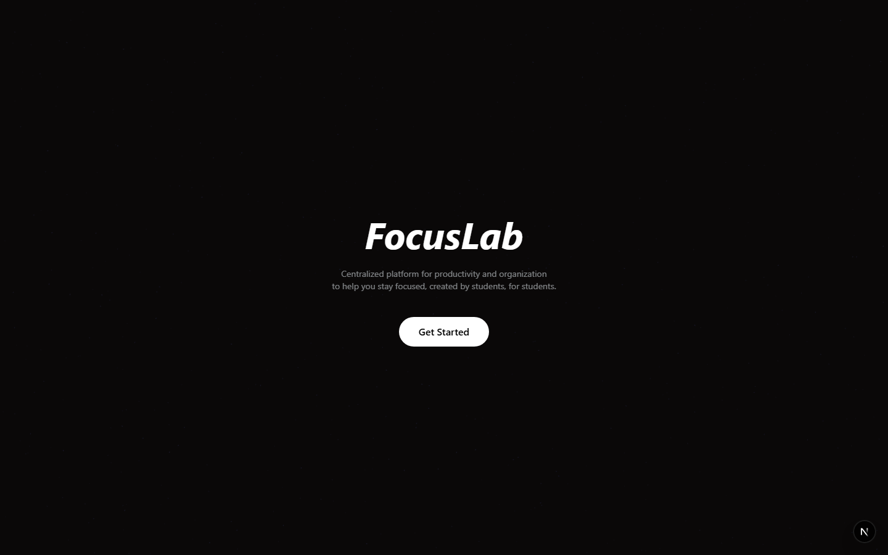
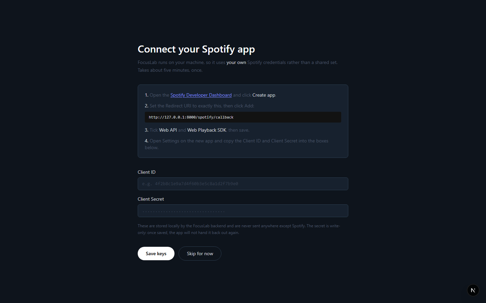
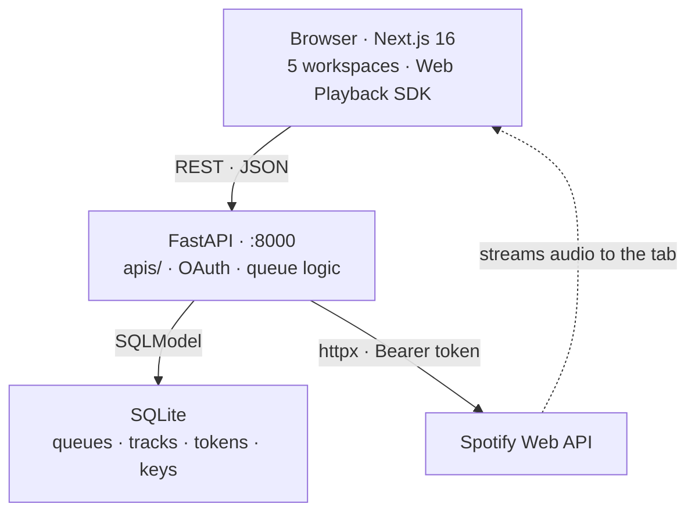

<div align="center">

# 🎯 FocusLab

### Five study tools in one window — with Spotify playing *inside the app itself.*

**No accounts. No cloud. No telemetry. Runs entirely on your machine.**

[](https://nextjs.org)
[](https://react.dev)
[](https://www.typescriptlang.org)
[](https://fastapi.tiangolo.com)
[](https://www.python.org)
[](https://developer.spotify.com/documentation/web-api)
[](https://www.docker.com)
[](#license)


</div>

---

Studying is a coordination problem before it's a discipline problem: five things in five places, and every switch costs focus. **FocusLab collapses them into one environment.**

The hard part isn't the timer. It's that **FocusLab registers itself as a Spotify Connect device** — audio streams into the app's own tab, and the Spotify client never has to be open. Getting that working meant solving device targeting, DRM iframe permissions, self-healing device IDs, and an OAuth flow the docs describe incorrectly.

<div align="center">

| **~5,300** | **27** | **4** | **5** |
|:---:|:---:|:---:|:---:|
| lines of code | REST endpoints | service packages | workspaces |

</div>

---

## 🧠 What this project demonstrates

Built solo, end to end — not a tutorial follow-along.

| Area | Evidence in this repo |
|---|---|
| **OAuth 2.0 from scratch** | Authorization Code flow, CSRF `state` with timing-safe comparison, single-use replay protection, 60s-early token refresh. No auth library. |
| **Third-party API integration** | Spotify Web API + Web Playback SDK, including undocumented response behaviour and honest error translation. |
| **Async Python** | FastAPI + `httpx`, async throughout the Spotify call path. |
| **API design** | 27 endpoints, one package per service, one file per HTTP method, schema-validated request/response boundaries. |
| **Layered architecture** | The device-targeting fix touched *one function*, not every route — because the layers were drawn correctly. |
| **Debugging under uncertainty** | Four documented bugs where the vendor's docs were wrong or the failure was invisible. See below. |
| **React state that survives navigation** | Player and timer own state at the shell level, so switching pages doesn't kill playback. |
| **Security reasoning** | Threat model stated explicitly, including what CORS *doesn't* do. |
| **Containerisation** | One `docker compose up` from clone to running. |

---

## 📸 Screenshots

<div align="center">

| Landing | Guided setup |
|---|---|
|  |  |

</div>

---

## 🗂️ Workspaces

| | Workspace | Purpose | State |
|---|---|---|---|
| 🏠 | **Home** | Pomodoro timer + Spotify-connected focus queues | ✅ **Shipped** |
| ✅ | **To-Do** | Task and assignment tracking | API done, UI pending |
| 📚 | **Notebook** | Session notes kept beside the work | API done, UI pending |
| 🤖 | **AI Study** | AI-assisted revision tools | Routed, UI pending |
| 📅 | **Calendar** | Deadlines and study scheduling | Routed, UI pending |

Home is complete end to end — UI, API, database, and a third-party integration in production shape. To-Do and Notebook have full CRUD APIs behind them. The architecture exists to make finishing the rest routine.

### Home, today

- **Focus timer** — 5/15/25-minute presets or any custom length, with restart and skip.
- **Focus queues** — named, ordered, persisted locally. Search Spotify inline, then play a queue as a whole so tracks advance *without ever mutating what you saved*.
- **Music without leaving the app** — the browser tab *is* the speaker.

---

## 🔧 Engineering highlights

> Shipping one workspace against a real third-party API surfaced problems worth documenting. These are the interesting ones.

<details open>
<summary><b>Spotify Connect device targeting — playback 404'd with a device sitting right there</b></summary>

<br>

Spotify plays nothing itself; it forwards commands to a **device**. Without a `device_id` it targets "the currently active device" — and an open-but-idle client is **available but not active**. So playback returned `404` while a perfectly good device sat idle.

The fix resolves and names a concrete device up front, which both routes the audio *and* wakes an idle client — preferring one already playing, so FocusLab **controls** your phone rather than hijacking it.

</details>

<details>
<summary><b>The browser as a device — three things had to line up simultaneously</b></summary>

<br>

The tab registers as a Connect device via the Web Playback SDK, which required:

1. A short-lived token endpoint for the browser — the **refresh token never leaves the server**.
2. A `device_id` override on every playback route.
3. A `Permissions-Policy` naming `sdk.scdn.co` for `encrypted-media` and `autoplay`.

Miss #3 and protected audio is **silently blocked** inside the SDK's cross-origin iframe — no error, no console warning, just nothing.

</details>

<details>
<summary><b>Self-healing stale device IDs</b></summary>

<br>

The SDK reconnects under a **new** id on every reload or dropped connection, so clients easily hold ids Spotify has already destroyed. A `404` now triggers one re-resolve and retry — guarded so it only fires for caller-supplied ids that actually changed, rather than retrying blindly.

</details>

<details>
<summary><b>Observation over documentation — every playback command was 500'ing</b></summary>

<br>

Spotify's docs say playback commands return `204 No Content`. They actually return **`200` with a bare non-JSON command id and no `content-type` header** — so `.json()` raised and every command 500'd.

Success parsing now keys off the response header, not the spec.

</details>

<details>
<summary><b>Honest error translation</b></summary>

<br>

Pausing an already-paused player returns Spotify's `403 "Restriction violated"` — which is really just poll lag, since UI state refreshes on a 5-second interval. That becomes a `409 Conflict` the frontend treats as a resync cue. **Genuine `403`s pass through verbatim** rather than being swallowed.

</details>

<details>
<summary><b>The OAuth state cookie that broke on a hostname</b></summary>

<br>

CSRF `state` originally lived in an `httponly` cookie. Logins started at `localhost:8000` silently failed — because the redirect URI is `127.0.0.1:8000`, and **cookies are host-scoped**: `localhost` and `127.0.0.1` are different origins. The cookie never came back, the state check failed, and the flow died at `?spotify=error`.

State is now held **server-side** with a 10-minute TTL. Same timing-safe `compare_digest` guarantee, plus two properties the cookie never had:

- **Replay protection** — state is consumed on first use; one state, one callback.
- **No browser dependency** — which matters, because a packaged desktop build using a custom-scheme redirect has no cookie jar at all.

</details>

---

## 🏛️ Architecture



**The backend never touches audio.** It authenticates, persists, and translates intent into commands. The browser is both the UI *and* the output device.

Spotify access is layered so each level owns exactly one concern — which is why the device fix touched a single function rather than all twelve routes:

```
route → player_command → spotify_api_request → httpx
        picks + heals     token + error mapping
```

And the dependency direction is one-way, enforced by structure:

```
router.py  ←  OAuth_Logic.py  ←  core.py  ←  routes/
(no deps)     flow + tokens      Web API     handlers
```

---

## 🛠️ Tech stack

| Layer | Technologies |
|---|---|
| **Frontend** | Next.js 16 · React 19 · TypeScript 5 · Tailwind CSS 4 · Spotify Web Playback SDK |
| **Backend** | FastAPI · SQLModel · SQLite · httpx · Spotify Web API (OAuth 2.0) |
| **Infra** | Docker Compose |

---

## 📁 Project structure

One package per service, one file per HTTP method — a path says what the code does.

```
backend/
├── main.py                      app, CORS, router mounting
├── database.py                  engine + per-request session
├── models_Queues.py             Queue, QueueTrack + schemas
├── models_Spotify.py            SpotifyToken
├── models_ToDo.py               Note + schemas
├── models_Keys.py               ApiCredentials + schemas
└── apis/
    ├── spotify/
    │   ├── router.py            the APIRouter, alone (breaks the import cycle)
    │   ├── OAuth_Logic.py       login · callback · token lifecycle · refresh
    │   ├── core.py              Web API calls · error mapping · device resolution
    │   └── routes/
    │       ├── get.py           player · devices · search · recently-played
    │       ├── put.py           pause · resume
    │       └── post.py          next · previous
    ├── queues/
    │   ├── core.py              router + shared lookups
    │   └── routes/              get · post · patch · delete
    ├── todo/
    │   ├── core.py
    │   └── routes/              get · post · patch · delete
    └── Retrieving_Keys/
        ├── core.py
        └── routes/              get · post

frontend/app/
├── (0)Intro_Components/         landing
├── (0.1)API_Keys/               guided Spotify credential setup
├── (1.1)Home/                   timer · queues · in-browser player · sidebar
├── (1.2)Notebook/  (1.3)To-Do/  (1.4)AI_Study/  (1.5)Calendar/
├── AppShell.tsx                 persistent shell — player survives navigation
└── SpotifyPlayerProvider.tsx    owns the Connect device connection
```

---

## 🚀 Getting started

**Requires** [Docker Desktop](https://www.docker.com/products/docker-desktop/). Music features need **Spotify Premium**; everything else runs without a Spotify account.

**1.** Create an app at the [Spotify dashboard](https://developer.spotify.com/dashboard) and add this exact redirect URI:

```
http://127.0.0.1:8000/spotify/callback
```

> ⚠️ Must be `127.0.0.1`, not `localhost` — Spotify stopped accepting `localhost` aliases in November 2025.

**2.** Copy `backend/.env_example` → `backend/.env` and fill in `SPOTIFY_CLIENT_ID`, `SPOTIFY_CLIENT_SECRET`, `SPOTIFY_REDIRECT_URI`.

**3.** Run it:

```bash
docker compose build     # first run only
docker compose up
```

**App** → [localhost:3000](http://localhost:3000) · **API** → [localhost:8000](http://localhost:8000) · **Interactive docs** → [/docs](http://localhost:8000/docs)

---

## 🔒 Security model

A single-user local application, with boundaries **stated rather than assumed**:

- **Client secret and refresh token are server-side only.** A leaked access token dies within the hour and cannot be renewed.
- **OAuth `state` is verified in constant time**, held server-side, and consumed on first use so a callback can never be replayed.
- **Request bodies are schema-validated**, so clients can't set ids or timestamps.
- **CORS is documented for what it *is*** — a browser rule about which origins may read responses, **not** an access control. Non-browser callers send no `Origin` and bypass it entirely.
- **Ports publish on all interfaces.** Binding to `127.0.0.1` is the one-line change that makes "local only" literally true.

Plain HTTP on the callback is deliberate, not an oversight: it's a **loopback** redirect, which [RFC 8252](https://datatracker.ietf.org/doc/html/rfc8252#section-7.3) prescribes for native apps and is the only HTTP Spotify still permits. No CA issues certificates for `127.0.0.1`, and the traffic never reaches a network interface.

---

## 🗺️ Roadmap

- [ ] **Desktop build** (Electron/Tauri) — one install per user, backend bundled on localhost
- [ ] **Authorization Code with PKCE** — a shipped binary can't hold a client secret
- [ ] **Per-install credentials** — setup UI is built; wiring it ahead of `.env` is one function away
- [ ] Notebook, To-Do, AI Study and Calendar front-ends onto their existing APIs

---

## 📄 License

MIT

<div align="center">
<br>
<sub>Built by <a href="https://github.com/MatiasPF1">Matias</a> — by students, for students.</sub>
</div>
