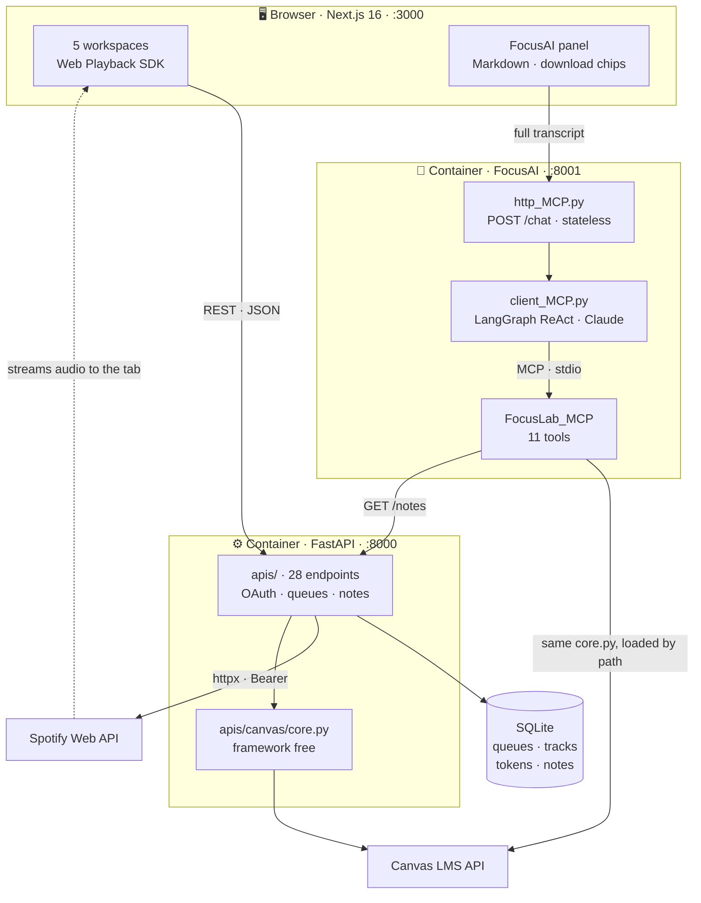

<div align="center">

# 🎯 FocusLab

### Five study tools in one window. Spotify plays *inside the app*. An AI agent reads your coursework and your notes — and hands you the PDFs.

**Runs entirely on your machine.**

[](https://nextjs.org)
[](https://react.dev)
[](https://www.typescriptlang.org)
[](https://fastapi.tiangolo.com)
[](https://modelcontextprotocol.io)
[](https://www.anthropic.com)
[](https://developer.spotify.com/documentation/web-api)
[](https://www.docker.com)


| **7,100** | **28** | **11** | **3** |
|:---:|:---:|:---:|:---:|
| lines of code | REST endpoints | MCP tools | containerised services |

</div>

---

## Three hard things, all built

**1 · FocusLab registers itself as a Spotify Connect device.** Audio streams into the app's own tab; the Spotify client never has to be open. Device targeting, DRM iframe permissions, self healing device IDs, and an OAuth flow the vendor documents incorrectly.

**2 · FocusLab ships its own MCP server.** Eleven tools over Canvas LMS *and the user's own notes*, consumed by a LangGraph agent **and** by the app's REST API — from one framework free implementation, not two.

**3 · The agent is a product surface.** FocusAI is a chat panel docked in the sidebar, running in its own container. Ask for Lectures 1 to 3 and the reply comes back as **clickable download chips**: pre signed Canvas URLs rendered as Markdown, not files written into a container you cannot reach.

**Shipped end to end:** Home (Pomodoro · Spotify queues · live Canvas tasks) and FocusAI. **APIs done, UI pending:** To-Do, Notebook, Calendar.

**Stack** · Next.js 16 · React 19 · TypeScript 5 · Tailwind 4 · FastAPI · SQLModel · SQLite · httpx · MCP (FastMCP) · LangGraph · Claude Haiku 4.5 · Docker Compose

---

## Architecture



**The backend never touches audio.** It authenticates, persists, and translates intent into commands. The browser is both the UI and the output device.

**One Canvas implementation, two consumers.** `core.py` is framework free, so FastAPI imports it and the MCP server loads it by file path — without installing a web framework on the agent side.

**The agent's arrow into notes points at the REST API, not the database.** The agent is a peer of the browser, not a privileged insider, and reaches user data through the same door.

---

## What broke, and what was actually true

Every row cost real debugging time. None were solved by guessing.

| Symptom | What was actually true |
|---|---|
| Playback `404`s with a device sitting right there | Spotify forwards commands to a **device**, and an open but idle client is *available, not active*. Resolving a device up front routes the audio **and** wakes the client. |
| Protected audio silently blocked. No error, no warning | The Web Playback SDK runs in a cross origin iframe. `Permissions-Policy` has to name `sdk.scdn.co` for `encrypted-media` and `autoplay`. |
| Every playback command `500`s | Docs promise `204 No Content`. Spotify returns **`200` with a bare non JSON command id and no `content-type`**, so `.json()` raised. Success now keys off the header. |
| OAuth dies at `?spotify=error` from `localhost` | Cookies are host scoped and the redirect URI is `127.0.0.1`. State moved **server side**: 10 min TTL, timing safe, single use — and no cookie jar needed for a future desktop build. |
| Agent confidently reports the wrong year's grade | The tools were fine; the model had no concept of *now*. Injecting the date turned `76.71 in 2025S MA 125` into `82.37 in MA 232`. |
| Mounting the Canvas router kills **every** route | `core.py` built its `httpx` client at import from `os.environ`, so a container without Canvas credentials `KeyError`'d before uvicorn started. Built on first use now; missing config `503`s one endpoint and nothing else notices. |
| Notes tools work in every test, refuse connections through the agent | **MCP's stdio transport does not inherit the environment** — it hands the child `PATH` and little else. Canvas survived only by accident, because `core.py` loads its own `.env`. |
| Canvas: `name` is the course name | `name` is the section code (`2026S CS 334-A`); `course_code` holds the readable title (`Theory of Computation`). Inverted. |
| Canvas: lecture slides are files | They are `<a href>` links inside a Page's HTML body. Module items report `file: null`, so the lectures look empty. |

---

## What it demonstrates

| Area | Evidence |
|---|---|
| **OAuth 2.0 from scratch** | Authorization Code flow, CSRF `state` with `compare_digest`, single use replay protection, 60s early refresh. No auth library. |
| **Protocol design (MCP)** | Own FastMCP server, 11 tools, stdio transport. Tool descriptions are the agent's only guidance channel, so every misleading default is documented in them. |
| **Tool contract design** | `read_notes` is unreachable without `list_notes` — ids exist nowhere but a tool result. Enforced in the prompt *and* both docstrings, because the description is what the model reads at call time. |
| **Zero duplication across surfaces** | One `core.py` serves FastAPI routes and MCP tools. The Spotify device fix touched *one function*, not twelve routes, because the layers were drawn correctly. |
| **Untrusted model output in the DOM** | Replies render as Markdown with raw HTML disabled. File links become download chips; everything else opens `noopener`. |
| **Handling hostile input** | Note bodies are `contentEditable` HTML — a pasted screenshot is a base64 data URI. Flattened to text before it reaches the model, images reduced to an `[image]` marker. |

---

## Run it

```bash
git clone https://github.com/MatiasPF1/FocusLab.git
cd FocusLab

cp backend/.env.example backend/.env          # Spotify credentials
cp Client_MCP/.env.example Client_MCP/.env    # Canvas token, Anthropic key
docker compose up
```

Frontend on `:3000`, API docs on `:8000/docs`, FocusAI on `:8001`. Three services, one command.

Spotify needs an app at [developer.spotify.com](https://developer.spotify.com/dashboard) with redirect URI `http://127.0.0.1:8000/spotify/callback` — they banned `localhost` redirects on 2025-11-27, so the loopback IP is required.

The agent also answers on the command line, which is the faster loop when working on its prompt or tools:

```bash
python Client_MCP/client_MCP.py "what is due this week?"
```

Request path: `browser → http_MCP.py → client_MCP.py → FocusLab_MCP/server.py`, the last hop over stdio. With the service down, the panel still opens and says so rather than failing silently.

---

## Security model

Single user, localhost only, by design.

- **Refresh tokens never reach the browser.** The frontend gets short lived access tokens from a dedicated endpoint.
- **CSRF state is server side**, timing safe, single use, 10 minute TTL. CORS is an allowlist, and it is not authentication.
- **Agent file writes are sandboxed** to `~/Downloads`, folder and filename both sanitized against traversal. Under Docker that path is inside a container, so the panel hands files over as Canvas links instead.
- **Pre signed Canvas URLs redirect across three hosts**, so downloads carry no `Authorization` header.

---

## What this unlocks next

The expensive part is built. Each of these is a tool on an MCP server that already exists, or a UI on an API that is already finished.

| Next | Why it is close |
|---|---|
| **Slides that answer questions** | Claude reads PDFs natively — text *and* rendered pages, so the automata diagrams count. A deck uploads once and is cited by page number forever after. |
| **A semester that fits in context** | One pass per lecture turns a 40 slide deck into dense notes. Twenty five of those is ~50k tokens: a whole course in one prompt, no vector database. |
| **Semantic links between notes and lectures** | Embed both sides and "related lectures" is one matrix multiply. 200 notes against 25 lectures is 5,000 comparisons — absurd as LLM calls, instant as vectors. |
| **To-Do, Notebook, Calendar UIs** | Their APIs are done and tested. Frontend work on a finished contract. |

---

## License

MIT
