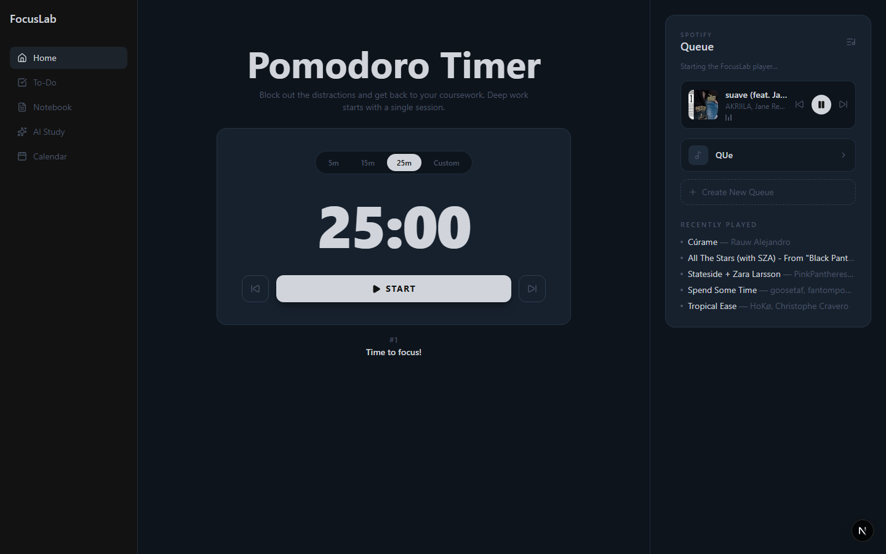
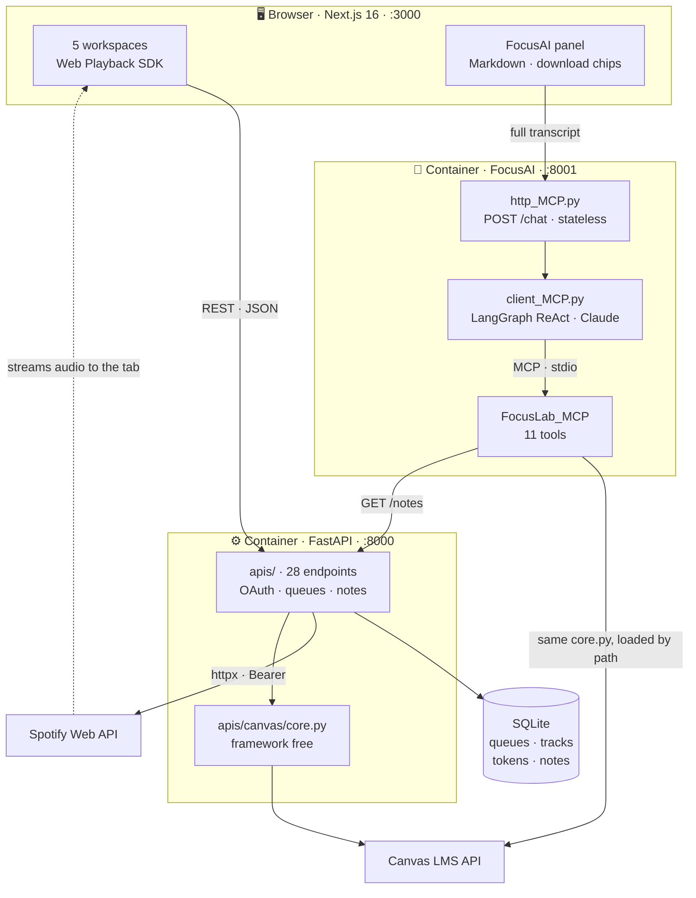

<div align="center">

# 🎯 FocusLab

### Five study tools in one window. Spotify plays *inside the app*. An AI agent reads your coursework and your notes — and hands you the PDFs.

**Runs entirely on your machine.**

[](https://nextjs.org)
[](https://react.dev)
[](https://www.typescriptlang.org)
[](https://fastapi.tiangolo.com)
[](https://modelcontextprotocol.io)
[](https://www.anthropic.com)
[](https://developer.spotify.com/documentation/web-api)
[](https://www.docker.com)



| **7,100** | **28** | **11** | **3** |
|:---:|:---:|:---:|:---:|
| lines of code | REST endpoints | MCP tools | containerised services |

</div>

---

## What this is

**FocusLab registers itself as a Spotify Connect device.** Audio streams into the app's own tab; the Spotify client never has to be open. Device targeting, DRM iframe permissions, self healing device IDs, and an OAuth flow the vendor documents incorrectly.

**It ships its own MCP server.** Eleven tools over Canvas LMS *and the user's own notes*, consumed by a LangGraph agent **and** by the app's REST API — from one framework free implementation, not two.

**The agent is a product surface.** FocusAI is a chat panel docked in the sidebar, running in its own container. Ask for Lectures 1 to 3 and the reply comes back as **clickable download chips**: pre signed Canvas URLs rendered as Markdown, not files written into a container you cannot reach.

**Shipped end to end:** Home (Pomodoro · Spotify queues · live Canvas tasks) and FocusAI. **APIs done, UI pending:** To-Do, Notebook, Calendar.

**Stack** · Next.js 16 · React 19 · TypeScript 5 · Tailwind 4 · FastAPI · SQLModel · SQLite · httpx · MCP (FastMCP) · LangGraph · Claude Haiku 4.5 · Docker Compose

---

## Architecture



**The backend never touches audio.** It authenticates, persists, and translates intent into commands. The browser is both the UI and the output device.

**One Canvas implementation, two consumers.** `core.py` is framework free, so FastAPI imports it and the MCP server loads it by file path — without installing a web framework on the agent side.

**The agent's arrow into notes points at the REST API, not the database.** The agent is a peer of the browser, not a privileged insider, and reaches user data through the same door.

---

## Run it

```bash
git clone https://github.com/MatiasPF1/FocusLab.git
cd FocusLab

cp backend/.env.example backend/.env          # Spotify credentials
cp Client_MCP/.env.example Client_MCP/.env    # Canvas token, Anthropic key
docker compose up
```

Frontend on `:3000`, API docs on `:8000/docs`, FocusAI on `:8001`. Three services, one command.

Spotify needs an app at [developer.spotify.com](https://developer.spotify.com/dashboard) with redirect URI `http://127.0.0.1:8000/spotify/callback` — they banned `localhost` redirects on 2025-11-27, so the loopback IP is required.

The agent also answers on the command line, which is the faster loop when working on its prompt or tools:

```bash
python Client_MCP/client_MCP.py "what is due this week?"
```

Request path: `browser → http_MCP.py → client_MCP.py → FocusLab_MCP/server.py`, the last hop over stdio. With the service down, the panel still opens and says so rather than failing silently.

---

## Security model

Single user, localhost only, by design.

- **Refresh tokens never reach the browser.** The frontend gets short lived access tokens from a dedicated endpoint.
- **CSRF state is server side**, timing safe, single use, 10 minute TTL. CORS is an allowlist, and it is not authentication.
- **Agent file writes are sandboxed** to `~/Downloads`, folder and filename both sanitized against traversal. Under Docker that path is inside a container, so the panel hands files over as Canvas links instead.
- **Pre signed Canvas URLs redirect across three hosts**, so downloads carry no `Authorization` header.

---

## Roadmap

The expensive part is built, so what is left leans on it. Lecture PDFs go to Claude whole — text and rendered pages, so the diagrams count — and one pass per lecture turns a 40 slide deck into notes dense enough that a whole course fits in a single prompt. Embedding those beside the user's own notes makes "related lectures" a matrix multiply instead of 5,000 LLM calls. To-Do, Notebook and Calendar are frontend work on APIs that are already done and tested.

---

## License

MIT
